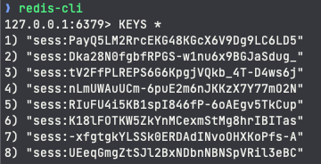

# Learnings

- `TypeGraphQL`: to provide typing for graph ql queries
- `GraphQL`: query for the API itself
- `Apollo-server-express`: express integration of apollo server. Helps to connect with the GraphQL server (apollo server)
- `MikroORM`: typescript ORM for node
- `argon2`: to encrpyt password, similiar to bcrypt usage
- `express`: nodejs server
- `nodemon`: to listen for changes which helps to "restart"
- `express-session`: to create a session to create a cookie and set its session ID to allow user to stay logged in. Coupled together with `redis` and `connect-redis`
- `redis`: used as a database, cache

### Note

when we do this we will do something like

```
req.session.userId = user.id;
```

{ userId: 1 } -> send that to redis

sess:asdfasdfasdf -> { userId: 1 }

express-session will set a cookie on my browser with `some signed stuff` (signed)

when user makes a request, this `some signed stuff` will be send to server

server will decrypt the cookie
`some signed stuff` to become sess:asdfasdfasdf

make a request to redis
sess:asdfasdfasdf -> { userId: 1}


